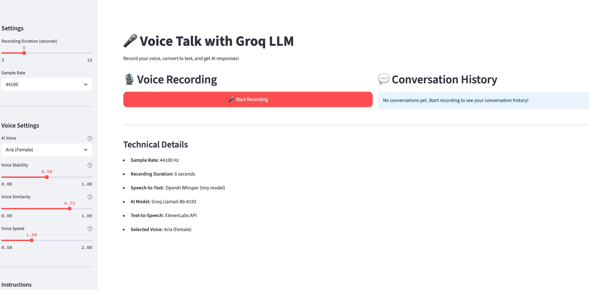

# 🎤 Voice Talk with Groq LLM

A Streamlit application that allows you to record voice, convert it to text using OpenAI Whisper, and get AI responses from Groq LLM.





## Features

- 🎙️ **Voice Recording**: Record audio with customizable duration and sample rate
- 🎯 **Speech-to-Text**: Convert speech to text using OpenAI Whisper
- 🤖 **AI Responses**: Get intelligent responses from Groq LLM (Llama3-8b-8192 model)
- 💬 **Conversation History**: View and manage your conversation history
- ⚙️ **Customizable Settings**: Adjust recording duration and sample rate
- 🎨 **Modern UI**: Beautiful and intuitive user interface

## Prerequisites

Before running this application, you need to:

1. **Install Whisper**: The application uses OpenAI Whisper for speech-to-text conversion
   ```bash
   pip install openai-whisper
   ```

2. **Set up API Keys**: Create a `.env` file in the project root with your API keys:
   ```
   GROQ_API_KEY=your_groq_api_key_here
   ELEVEN_LABS_API_KEY=your_elevenlabs_api_key_here
   ```

   To get the API keys:
   
   **Groq API Key:**
   - Visit [Groq Console](https://console.groq.com/)
   - Sign up or log in
   - Create a new API key
   - Copy the key to your `.env` file
   
   **ElevenLabs API Key:**
   - Visit [ElevenLabs Console](https://elevenlabs.io/)
   - Sign up or log in
   - Go to Profile Settings → API Key
   - Copy your API key to your `.env` file

## Installation

1. **Clone or download the project files**

2. **Install Python dependencies**:
   ```bash
   pip install -r requirements.txt
   ```

3. **Create `.env` file** (if not already created):
   ```bash
   echo "GROQ_API_KEY=your_actual_groq_api_key_here" > .env
   echo "ELEVEN_LABS_API_KEY=your_actual_elevenlabs_api_key_here" >> .env
   ```

4. **Test ElevenLabs integration** (optional):
   ```bash
   python test_elevenlabs.py
   ```

## Usage

1. **Run the Streamlit application**:
   ```bash
   streamlit run app.py
   ```

2. **Open your browser** and navigate to the URL shown in the terminal (usually `http://localhost:8501`)

3. **Start using the application**:
   - Adjust recording settings in the sidebar if needed
   - Select your preferred AI voice from the voice settings
   - Click "🎤 Start Recording" to begin voice recording
   - Speak clearly into your microphone
   - Wait for the transcription and AI response
   - Listen to the AI voice response
   - View your conversation history on the right side

## File Structure

```
voice-talk/
├── app.py                 # Main Streamlit application
├── main.py                # Original command-line version
├── requirements.txt       # Python dependencies
├── test_elevenlabs.py    # ElevenLabs API test script
├── setup.py              # Setup script
├── README.md             # This file
└── .env                  # Environment variables (create this)
```

## Configuration

### Recording Settings
- **Recording Duration**: 3-15 seconds (adjustable via slider)
- **Sample Rate**: 22050, 44100, or 48000 Hz (selectable)

### AI Model
- **Model**: Groq Llama3-8b-8192
- **Memory**: Conversation buffer with 5 previous interactions
- **Prompt Template**: "Shortly, answer this question: {question}."

### Speech-to-Text
- **Model**: OpenAI Whisper (tiny model)
- **Language**: English
- **Output**: Plain text

### Text-to-Speech
- **Service**: ElevenLabs API
- **Available Voices**: Aria, Sarah, Laura, Charlie, George
- **Format**: WAV
- **Model**: Eleven Monolingual v1
- **Features**: Voice stability and similarity controls

## Troubleshooting

### Common Issues

1. **"whisper command not found"**
   - Make sure you've installed Whisper: `pip install openai-whisper`
   - On some systems, you might need to restart your terminal

2. **"GROQ_API_KEY or ELEVEN_LABS_API_KEY not found"**
   - Ensure your `.env` file exists and contains both API keys
   - Check that the keys are valid in their respective consoles

3. **Audio recording issues**
   - Check your microphone permissions
   - Ensure your microphone is working and not muted
   - Try different sample rates if you experience audio quality issues

4. **Memory issues with long conversations**
   - The app automatically limits conversation history to prevent memory issues
   - You can refresh the page to clear the conversation history

### Performance Tips

- Use a good quality microphone for better transcription accuracy
- Speak clearly and at a moderate pace
- Keep background noise to a minimum
- For longer questions, consider breaking them into shorter recordings

## Technical Details

- **Framework**: Streamlit
- **Audio Processing**: sounddevice, scipy
- **Speech-to-Text**: OpenAI Whisper
- **AI Model**: Groq Llama3-8b-8192 via LangChain
- **Text-to-Speech**: ElevenLabs API
- **Memory Management**: ConversationBufferWindowMemory
- **File Handling**: Temporary files for audio processing

## Contributing

Feel free to submit issues, feature requests, or pull requests to improve this application!

## License

This project is open source and available under the MIT License. 
